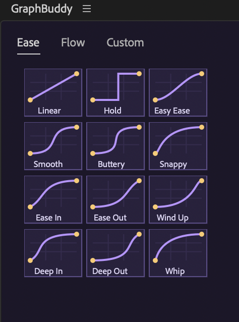
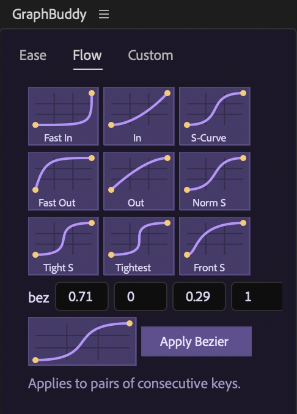
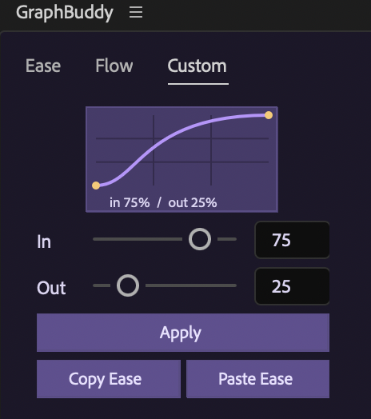
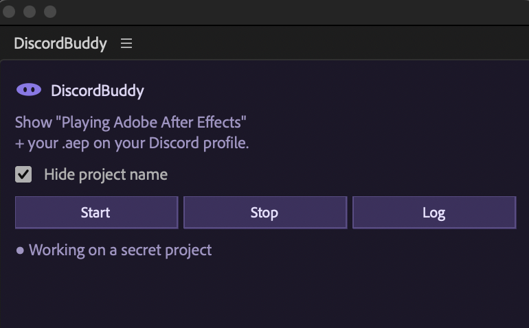
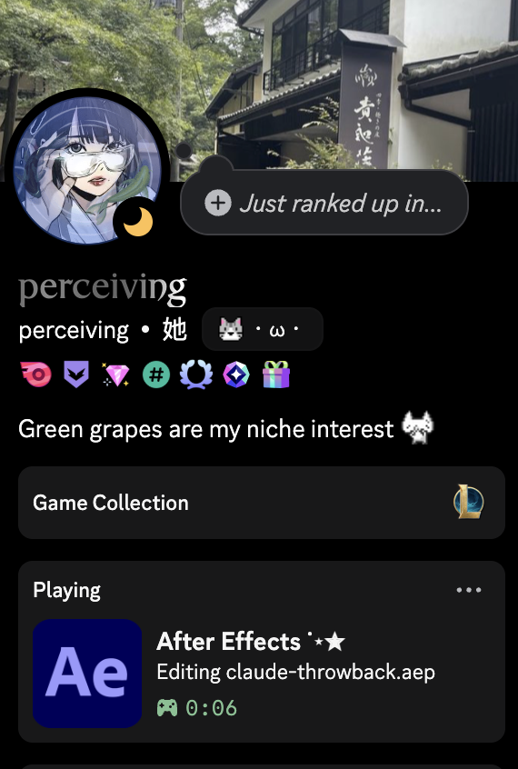

# softplugins

my own ae plugins for free

## plugins

- **[BuddyHub](BuddyHub/)** — the home page: a dockable launcher listing every installed Buddy with its icon; click to open or close its panel. New buddies appear automatically. See [BuddyHub/README.md](BuddyHub/README.md).
- **[GraphBuddy](GraphBuddy/)** — one-click graph editor eases for After Effects: graph-tile ease presets, Flow-style cubic-bezier pack, object morphing, loops, and motion FX. See [GraphBuddy/README.md](GraphBuddy/README.md) for install + docs.
- **[DiscordBuddy](DiscordBuddy/)** — Discord Rich Presence for After Effects: shows *"Playing Adobe After Effects"* with your current `.aep` on your Discord profile. No account setup — the Discord app connection is built in, just press Start. See [DiscordBuddy/README.md](DiscordBuddy/README.md) for install + docs.

## examples

### GraphBuddy

  
  
  

### DiscordBuddy

  
  

